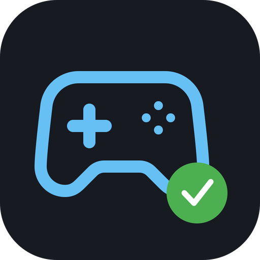

<p align="center">
  
</p>

<h1 align="center">Gamekeeper</h1>

<p align="center">
  <strong>Got 500+ Steam games and no idea what to play?</strong><br/>
  Gamekeeper organizes your library, shows how long each game takes, and recommends what to play next.
</p>

<p align="center">
  <a href="https://github.com/LordVelm/gamekeeper/releases/latest"></a>
  <a href="https://github.com/LordVelm/gamekeeper/blob/master/LICENSE"></a>
  
</p>

---

<!-- TODO: Add 2-3 screenshots here


-->

## What It Does

Gamekeeper automatically sorts every game in your Steam library into four collections:

| Collection | What goes here |
|---|---|
| **Completed** | Games you've finished the main story |
| **In Progress** | Completable games you haven't finished yet |
| **Endless** | Multiplayer, sandbox, strategy... games with no real ending |
| **Not a Game** | Demos, tools, soundtracks, servers |

Collections sync across machines via Steam Cloud. No manual sorting required.

**How?** 14 deterministic rules analyze your Steam data (store info, achievements, playtime). No paid APIs, no black boxes. Just your free Steam Web API key.

## Features

**Organize**
- Automatic classification with 14 priority rules
- Manual overrides when you disagree (overrides always win)
- Results persist between runs. Only new games get re-classified

**Discover**
- **HowLongToBeat integration** — Completion time estimates for every game, fetched automatically
- **"Short games" filter** — Slider to find games that fit the time you have tonight
- **"What should I play next?"** — AI chat that knows your library, playtime, and how long each game takes
- **Time-aware recommendations** — Ask "I have 2 hours" and it picks games that actually fit

**Built right**
- Dark Steam-inspired theme
- All data stays on your machine. No cloud services, no telemetry
- Cached locally so subsequent launches are instant
- Tested on a 571-game library

## Download

**[Download the latest release](https://github.com/LordVelm/gamekeeper/releases/latest)** (Windows installer)

Or build from source:

```bash
cd app
npm install
npx tauri build
```

You'll need a free [Steam Web API key](https://steamcommunity.com/dev/apikey) and your Steam profile's game details set to **Public**.

## Optional: Local AI

Gamekeeper bundles a local AI engine (Qwen2.5-14B-Instruct) for game recommendations and classification second opinions. On first use, it downloads the model (~16 GB). No external software, no API keys, no subscriptions.

The AI powers:
- **"What should I play next?"** — Conversational chat grounded in your actual library data
- **Ambiguity assistant** — Second opinions on games the rules aren't sure about

The AI is never used for core classification. Rules stay canonical. GPU acceleration is automatic with NVIDIA CUDA. CPU fallback works too (just slower).

**To set up:** Settings > AI Assistant > Download AI Model

## System Requirements

| | Minimum (without AI) | Recommended (with AI) |
|---|---|---|
| OS | Windows 10 64-bit | Windows 10/11 64-bit |
| RAM | 4 GB | 16 GB |
| Storage | 100 MB | 18 GB free |
| GPU | Not required | NVIDIA GPU with 16+ GB VRAM (optional) |

## Good to Know

- **First sync takes 10-15 minutes** for large libraries (500+ games) due to Steam API rate limits. After that, launches use cached data and only fetch new games.
- **Completion times** are from [HowLongToBeat](https://howlongtobeat.com/) (community-sourced, unofficial). Cached locally and refreshed on each sync.
- **Steam must be closed** when writing collections.
- **All data is local** — API keys in `%APPDATA%/Gamekeeper/config/settings.json`, game data in `%APPDATA%/Gamekeeper/cache/`.

## Built With

[Tauri v2](https://tauri.app/) + [React 19](https://react.dev/) + TypeScript + Rust

See [`CLAUDE.md`](./CLAUDE.md) for architecture details.

## License

[MIT](./LICENSE) — Created by [LordVelm](https://github.com/LordVelm)

## Feedback

- **Bug reports & feature requests** — [Open an issue](https://github.com/LordVelm/gamekeeper/issues)
- **Support the project** — [Buy Me a Coffee](https://buymeacoffee.com/lordvelm)
